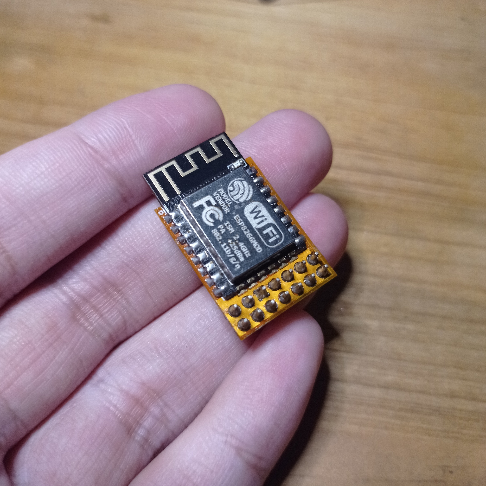
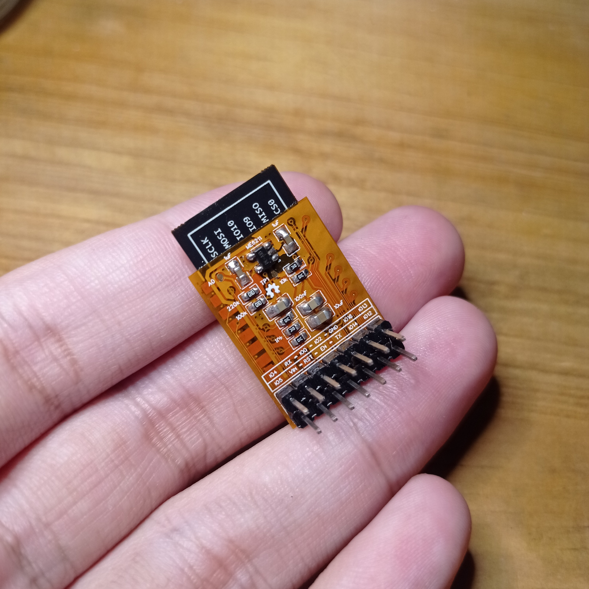
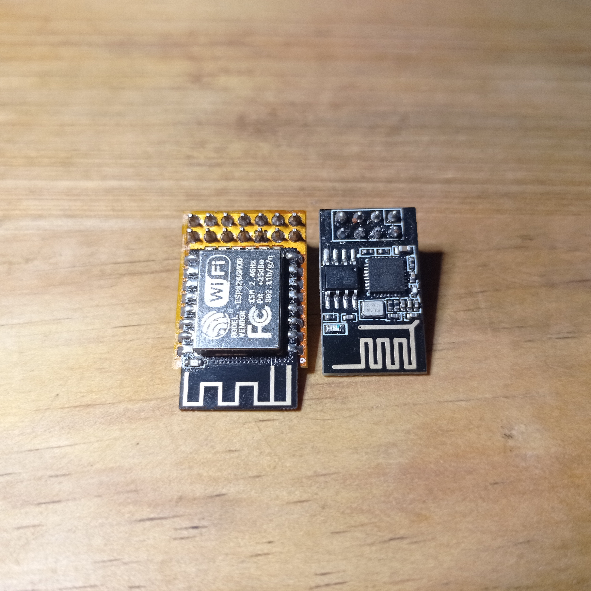

**miniEsp** is a practical and powerful upgrade to the ESP-01, offering more I/O options and better voltage protection, all while maintaining compatibility with the existing ESP-01 pin header format.

# Overview

The **miniEsp** is my solution to the limitations of the ESP-01 module. One of the biggest issues I faced with the ESP-01 was its lack of I/O pins, having only 2 I/O pins made it too restrictive for many of my projects. I wanted a more capable, versatile version of the ESP-01, so I designed the miniEsp. A larger, more powerful version based on the popular ESP-12F module.

The miniEsp provides 8 I/O pins, which significantly expands its capabilities compared to the ESP-01. With 8 I/O pins, the miniEsp gives me more flexibility and options, making it a great choice for a wider variety of IoT and richer applications.

## Voltage Regulator

The key concerns when designing miniEsp with ESP8266-based boards like the ESP-01 or ESP-12F is power compatibility. I often use 5V power sources which can risk the ESP8266’s voltage tolerance. To solve this, i added the commonly and widely known ME6211 LDO to the miniEsp. This chip ensures that the ESP-12F receives a safe 3.3V supply, even when powered by 5V sources, preventing potential damage to the module and improving overall reliability.

### Comparison

Despite the increased size, the miniEsp keeps the same pin header format as the ESP-01, which means it is still compatible with existing projects that use the ESP-01’s pinout. This ensures that it can be easily integrated into new and existing setups without requiring significant changes to my hardware design.

#### References
- [ESP-12F Datasheet](https://docs.ai-thinker.com/_media/esp8266/docs/esp-12f_product_specification_en.pdf)
- [ME6211 Datasheet](https://www.lcsc.com/datasheet/lcsc_datasheet_2410121248_MICRONE-Nanjing-Micro-One-Elec-ME6211C30M5G_C94042.pdf)
